### O desafio do projeto solo-dev

Todo desenvolvedor já teve a ideia de um projeto, aquele famoso "vai que dá certo?", que recebeu 1 ou 2 commits iniciais e depois foi arquivado por falta de tempo ou de definições claras. 

Ao dar forma a essa ideia, começam a surgir os desafios, sejam eles técnicos (como 'que tecnologia usar?' ou 'como implementar isso?') ou de produto (como 'quais as próximas funcionalidades?').

Todas essas perguntas, e muitas outras, surgem naturalmente ao decorrer do desenvolvimento de qualquer projeto. Como no dia-a-dia, as coisas vão surgindo e temos que lidar com elas.

No ambiente corporativo, onde geralmente fazemos parte do time de Engenharia e Desenvolvimento (software engineers, developers, etc.), somos responsáveis pela resolução de questões técnicas. Possuímos o conhecimento necessário para lidar com elas, seja por experiência prévia (conhecimento adquirido) ou por pesquisa (habilidade de buscar informações).

Em contrapartida, o time de Produto (product owners, product managers, etc.) possui o conhecimento para responder às perguntas de produto.

**Mas e em um projeto solo? Nesse cenário, você possui apenas parte do conhecimento. Como, então, responder com confiança?**

Hoje, eu abro o terminal, inicio o Claude Code, e uso a skill **brainstorming** do plugin **Superpowers**.
E é game-changing.

### Planejando uma Feature (eu e o Cláudio)

As LLMs produzem código de qualidade. Isso já é um fato em 2026, e nosso trabalho hoje consiste mais em direcionar o desenvolvimento e revisar as alterações. Entretanto, a abordagem de planejamento de desenvolvimento delas assemelha-se à de um desenvolvedor inexperiente: poucas perguntas sobre implementação/estrutura e foco na entrega de um plano que conseguem executar.

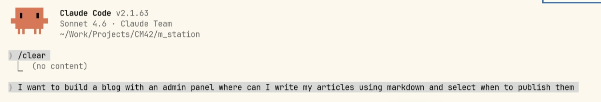

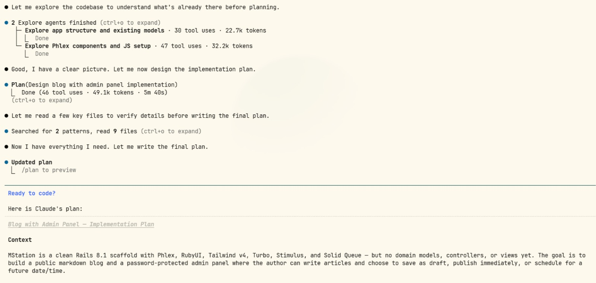

Isso funciona quando há uma funcionalidade bem definida, e as alterações e melhorias dependem, em grande parte, da minha capacidade de direcionar o agente. Ele questiona pouco e foca na entrega.

Isso muda completamente quando se tem apenas uma ideia geral do que se deseja fazer. O agente tenta resolver de maneira direta, mesmo com um prompt que, sob uma perspectiva humana, está incompleto.

LLMs não são determinísticas, então, às vezes, o agente faz algumas perguntas quando recebe um prompt abrangente. Todavia, são poucas, e o processo não é consistente.

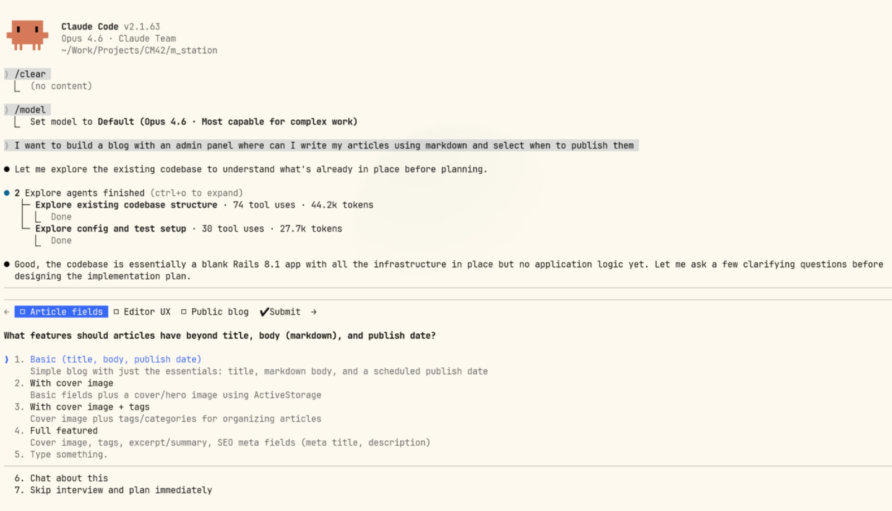

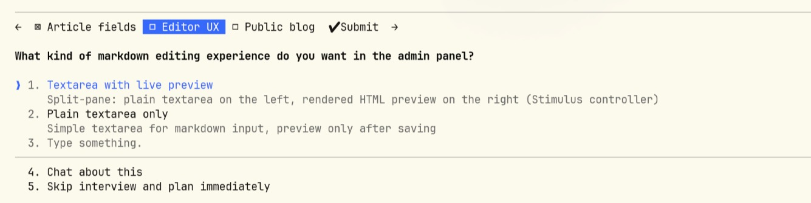

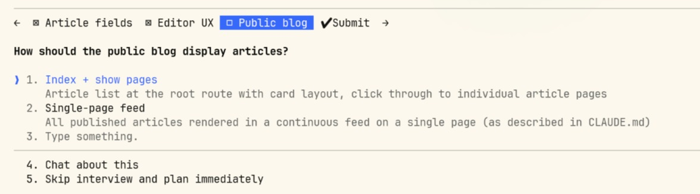

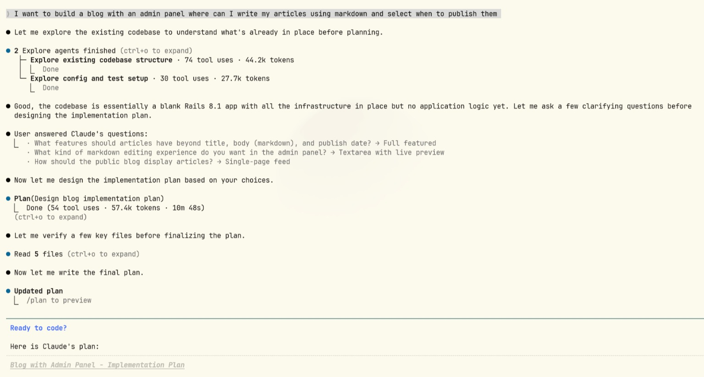

O Brainstorming muda completamente essa experiência: o Claude começa a pensar junto comigo como melhorar o projeto.

### Brainstorming - uma nova (pelo menos para o Claude) forma de planejar

Brainstorming é uma das skills do plugin superpowers, e roda antes de iniciar a implementação de código. A função dele é entender o projeto, discutir a feature nova, questionar detalhes até chegar a um documento de design, que vai ser usado na implementação da feature selecionada.

O fluxo consiste em 6 passos:
- Explorar o contexto existente
- Fazer perguntas relacionadas
- Propor 2-3 abordagens
- Apresentar design para aprovação
- Escrever a documentação de design
- Transicionar para o plano de implementação

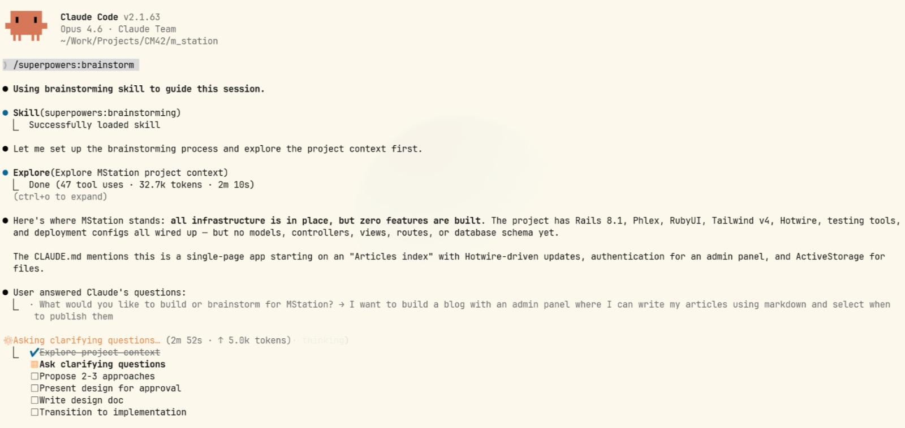

Após entender o contexto existente, ele inicia uma rodada de perguntas sobre o que se deseja implementar, com opções pré-geradas e a possibilidade de discutir cada pergunta.

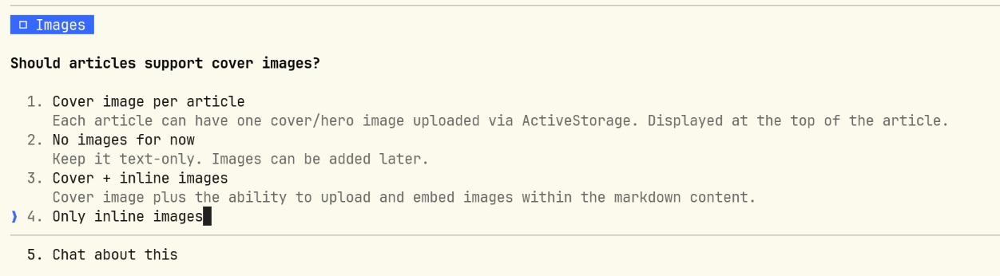

Após essas perguntas, ele resume o que entendeu da nova feature, com as especificações definidas durante a sessão.

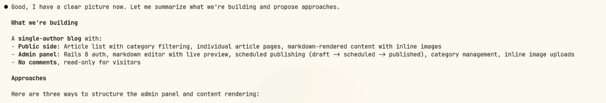

Ele fornece 2 a 3 opções de implementação, recomendando uma:

Por fim, ele revisa o plano de implementação da opção escolhida, passo a passo, e solicita confirmações. Também exibe o planejamento de tarefas,

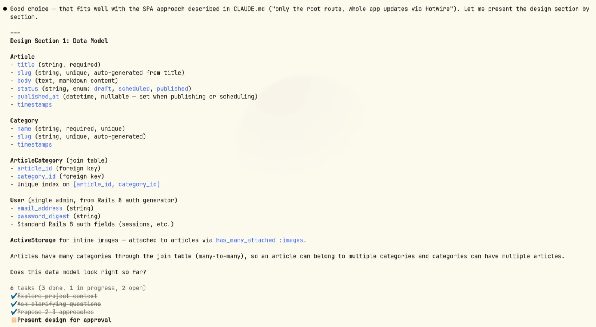

e valida aquele passo, com abertura para alterações.

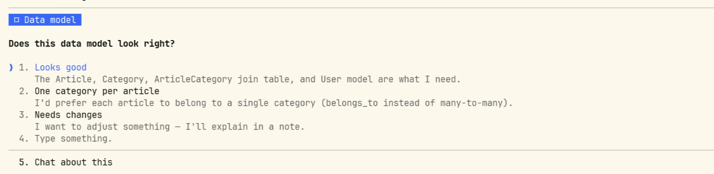

Tudo isso para, finalmente, gerar o documento de design daquela sessão de brainstorming e prosseguir para a elaboração do documento de implementação.

Nesse documento, ele determina os passos da implementação, os códigos que serão editados, os testes a serem gerados, comandos - tudo relacionado ao desenvolvimento daquela feature que foi discutida.

Uma sessão de brainstorming, design e planejamento - tudo conversado com a IA.

### IA no mundo do desenvolvimento

O mercado de desenvolvimento está mudando. A evolução dos agentes de código permite que desenvolvedores foquem cada vez em aspectos de produto. 
Decisões de arquitetura, planejamento, escopo, geração de tasks: atividades que antes eram reservadas ao time de produto agora fazem parte do dia-a-dia de devs. Boas práticas de programação se tornaram ainda mais necessárias. O programador toma decisões, e coordena um time de um ou mais agentes de código.

Uma ferramenta que te ajuda a pensar, como o brainstorming, traz os recursos da LLM para o lado do produto também - a velocidade de pesquisa, o conhecimento de documentações, o poder de planejamento. Habilidades que facilitam nossa vida.

Entretanto, as LLMs ainda não conseguem substituir o principal fator humano no desenvolvimento de qualquer produto: a criatividade. A máquina copia, cita, pesquisa, mas não possui pensamento original. Ainda precisa de um direcionamento humano, tanto no planejamento do produto quanto na supervisão da execução técnica.

## O que eu aprendi

Eu sempre gostei de prototipar, mas sempre ficava travado no desafio entre pesquisar/planejar/executar/refatorar o projeto e conciliar isso com o resto da minha vida profissional.

O brainstorming mudou a experiência do Claude Code para mim: não sou um gênio de produto, tenho as ideias gerais, mas não os detalhamentos finais - esses saíram conversando com o robô (uma versão atualizada do famoso *rubber duck*?). O documento de design é ótimo para revisar ideias, e o documento de implementação é maravilhoso para revisar a implementação. 

No fim, ainda é minha ideia, e meu produto. Só que feito em dupla.